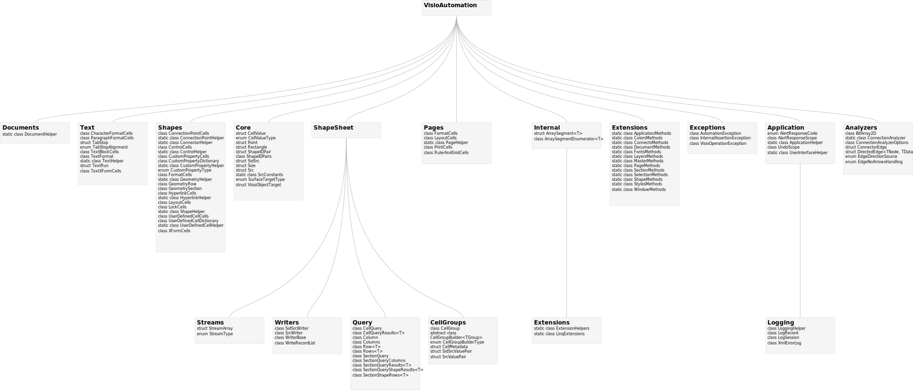

# Classes

The diagram below shows the main classes in VisioAutomation grouped by namespace. For an authoritative current list, browse the source under [`VisioAutomation_2010/VisioAutomation/`](https://github.com/saveenr/VisioAutomation/tree/master/VisioAutomation_2010/VisioAutomation). The diagram may lag behind the latest code.

