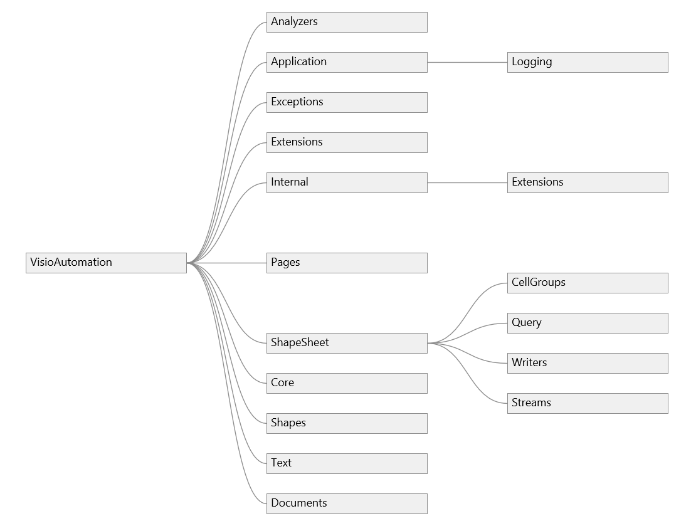

# Namespaces

The diagram below shows the namespace structure of VisioAutomation. The `Core` namespace holds the fundamental value types (`Src`, `SidSrc`, `CellValue`, `Point`, `Size`, `Rectangle`); the `ShapeSheet` namespace contains the query and writer infrastructure; the `Shapes`, `Pages`, and `Documents` namespaces hold per-target helpers; and `Extensions` adds extension methods to the Visio COM types. For an authoritative current list, browse the source under [`VisioAutomation_2010/VisioAutomation/`](https://github.com/saveenr/VisioAutomation/tree/master/VisioAutomation_2010/VisioAutomation).

